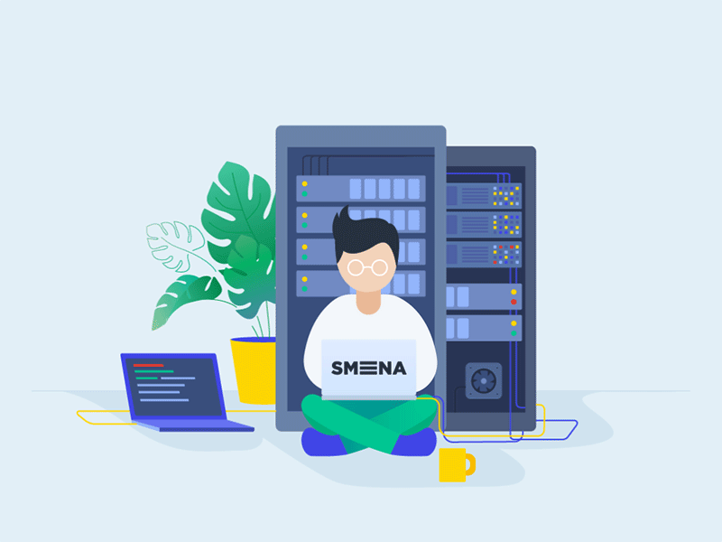

<h1 align="center">Hi 👋, I'm Ayush Gala</h1>

<h3 align="center">A budding computer scientist from Raleigh, North Carolina, interested in Software Development, System Design, and High-Performance Computing research. I also enjoy Indie-game development and actively study AI/ML research happening worldwide.</h3>

<p align = "center">
	
</p>

```sh

var courses = {
    "Graduate Level": {
        "Core": ["Operating Systems", "Parallel Computer Architecture", "Parallel Systems", "Software Engineering"],
	"Data Science": ["Automated Learning & Data Analysis", "Advanced Neural Networks"]
    },

    "Undergraduate Level": {
        "Core": ["Data Structures & Algorithms", "Databases", "Computer Networks & Security", "Big Data Analysis",
					"System Programming & OS", "Microprocessor"],
        "Electives": ["High-Performance Computing", "Cybersecurity", "Internet of Things", "Pattern Recognition"],
	"Honors": ["Artificial Intelligence", "Machine Learning", "Deep Learning", "Fuzzy Logic"],
	"Mathematics": ["Discrete Maths", "Calculus I", "Calculus II", "Computer Logic"]
    },

    "Specialized Topics": {
        "Research": ["Noise Cancellation in Indic Speech", "BLE Proximity Detection for Tourism", 
                     "Hybrid Sampling in Network Intrusion Detection Systems"],
        "Tools & Applications": ["CUDA Programming", "OpenMP Programming", "OCR", 
                                  "LLMs", "SaaS Development"]
    }
};

var development = {
    "AI & Machine Learning": {
    	"Frameworks" : ["TensorFlow", "Keras", "PyTorch", "Scikit-learn", "DeepFilterNet3", "SpeechBrain"],
    	"Technologies" : ["CUDA", "OpenMP", "Tesseract OCR", "GPT-3.5", "NumPy", "Pandas", "Matplotlib",
					"Seaborn", "NLTK", "SpaCy"]
    },

    "Web & DevOps" : {
        "Languages" : ["HTML", "CSS", "JavaScript", "TypeScript", "Java", "Lua", "PHP", "SQL"],
        "Frameworks & Libraries" : ["Android Studio", "Node.js", "Express.js", "Three.js",
                                     "MongoDB", "SQL", "React", "Postman", "Next.js", "Electron.js"],
        "Tools & Technologies" : ["Docker", "Kubernetes", "Jenkins", "AWS", "Git", "Linux"]
    },

    "Game Development": {
        "Languages" : ["Lua" , "C#" , "Python" , "C++" , "JavaScript"],
        "Frameworks & Tools" : ["LÖVE2D", "Unity", "Blender", "Tiled", "Adobe Photoshop"]
    },

    "IOT & Embedded Systems" : {
        "Languages" : ["Embedded C", "Assembly", "Python"],
        "Frameworks & Tools" : ["ThingSpeak", "AWS", "RaspberryPi", "ESP32", "Arduino", "BLE"]
    }
};

var experience = {
    "Programming": {
        "Languages" : ["Embedded C", "C++", "C#", "Java", "Python", "Lua", "x86 Assembly", "JavaScript",
                       "TypeScript", "SQL", "HTML & CSS", "PHP", "Dart"],
        "Frameworks" : ["Node.js", "React.js", "Express.js", "Three.js", "Flutter", "Next.js", "Electron.js"]
    },

    "Skills": {
        "Languages" : ["English", "Hindi", "Marathi", "Gujarati", "French"],
        "Design": ["Figma", "Adobe Photoshop", "Adobe Illustrator", "Blender", "Canva"],
        "Content": ["Editing", "Grammarly", "Proofreading", "Documentation"],
        "Marketing": ["Sourcing", "Partnerships", "Budget Management", "Social Media management"],
        "Public Speaking": ["Compeering", "Speech", "Debate", "Discussion"]
    }
};

```
<!-- <div align=right>
    <a href="https://github.com/anuraghazra/github-readme-stats">
      
    </a>
</div> -->

<p align = "center">
	<strong> 👨‍💻Connect with me on other platforms!</strong>
</p>

<p align = "center">
	<a href = "https://www.linkedin.com/in/ayush-gala/" target = "_blank"></a>
	<a href = "mailto:ayushgala2@gmail.com/" target = "_blank"></a>
    <a href = "https://discord.gg/29VOID#2423" target = "_blank"></a>
	<a href = "https://twitter.com/ayushgala2/" target = "_blank"></a>
    <a href = "https://www.instagram.com/_.ayukiddinme._/" target = "_blank"></a>
	<a href = "https://fb.com/ayush gala" target = "_blank"></a>
	</p>

<p>
	<a href="https://github.com/ashutosh00710/github-readme-activity-graph"></a>
</p>

<p align="center">
	
	
</p>

<a href="https://github.com/anuraghazra/github-readme-stats" title="Go to Source">
      
 </a>
  <a href="https://git.io/streak-stats" title="Go to Source">
      
 </a>
<br><br><br><br><br><br><br><br><br>


- Thanks for visiting this profile. Follow me to get all the updates about my repositories, games and my open source work!
<h1 align = "center">HAVE A WONDERFUL DAY! ❤</h1>
<br>
